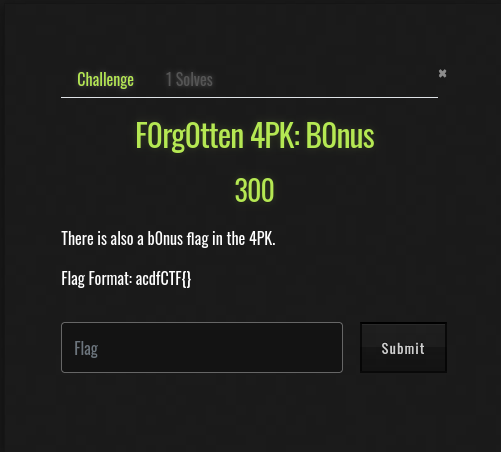
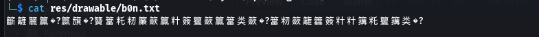
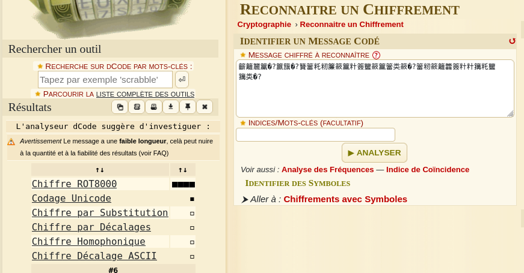
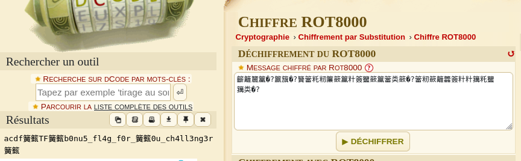

**Context**

I found this file at this path `res/drawableb0n.txt`

**Reading this file**

I use dcode to find the cypher https://www.dcode.fr/identification-chiffrement

It's **ROT 8000**

I decode the message with this https://www.dcode.fr/chiffre-rot8000

There are some caracteres that can't be print correctly. I try to guess them and I got the flag

**FLAG:** `acdfCTF{b0nu5_fl4g_f0r_y0u_ch4ll3ng3r}`
